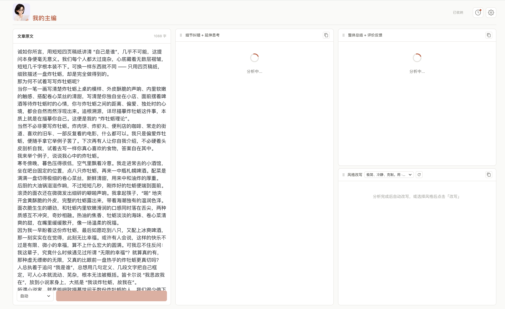
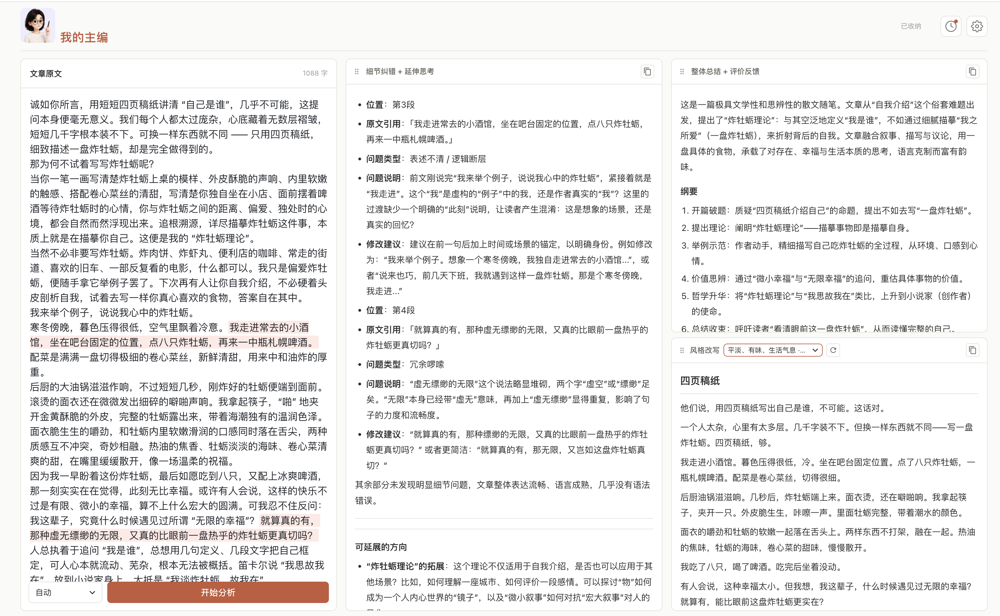
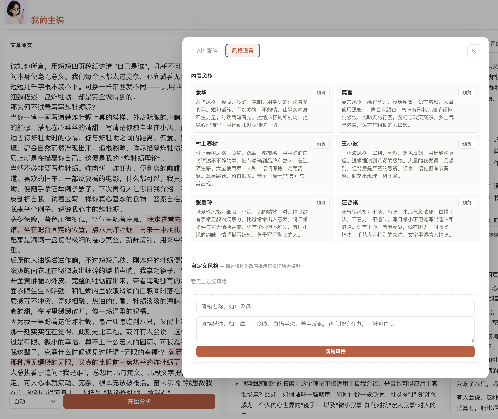

# 我的主编 — AI 编辑

像编辑一样帮你改文章。粘贴文章，一键获得专业编辑的 4 维度分析反馈。







## 快速开始

```bash
# 1. 创建虚拟环境（仅首次）
python3 -m venv venv
source venv/bin/activate

# 2. 安装依赖
pip install -r requirements.txt

# 3. 启动服务
python app.py
```

浏览器打开 **http://127.0.0.1:5001**

## 配置 API

启动后，点击右上角 **⚙ 设置** 图标，填入你的 LLM API 信息：

| 字段 | 说明 | 示例 |
|------|------|------|
| API 地址 | 兼容 OpenAI 接口的地址 | `https://api.openai.com/v1` |
| 模型名称 | 要使用的模型 | `gpt-4o` / `claude-sonnet-4-20250514` |
| API 密钥 | 你的 API Key | `sk-...` |

设置会自动保存在浏览器中，下次打开无需重新输入。

## 使用方式

1. 在左侧输入框粘贴你的文章（或直接写作）
2. 点击 **「开始分析」** 按钮（或按 `Cmd + Enter`）
3. 等待 AI 主编分析完成
4. 在右侧 4 个 Tab 中查看各维度反馈：
   - **整体总结** — 概要 + 纲要 + 标签
   - **评价反馈** — 亮点 / 不足 / 针对性训练建议
   - **细节纠错** — 病句、语序、逻辑问题逐条分析
   - **延伸思考** — 延展方向 + 升华角度 + 追问

点击 **「复制当前」** 复制当前 Tab 内容，或 **「复制全部」** 复制完整分析报告。

## 技术栈

- **后端**：Python Flask
- **前端**：原生 HTML/CSS/JS + marked.js Markdown 渲染
- **LLM**：兼容 OpenAI Chat Completions API（支持任意厂商）
